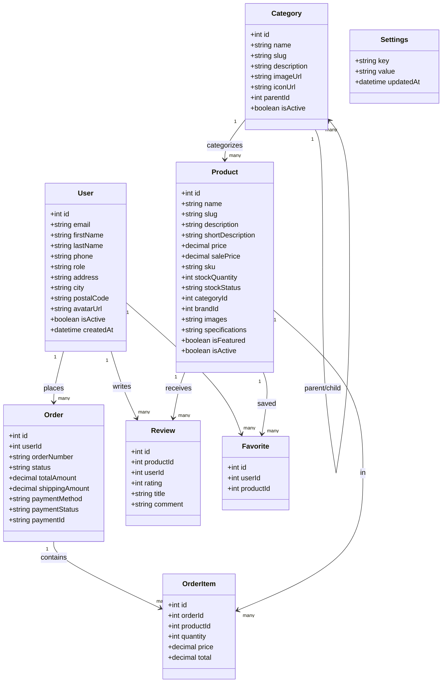

# Диаграмма классов

```mermaid
classDiagram
  class User {
    +int id
    +string email
    +string firstName
    +string lastName
    +string phone
    +string role
    +string address
    +string city
    +string postalCode
    +string avatarUrl
    +boolean isActive
    +datetime createdAt
  }

  class Product {
    +int id
    +string name
    +string slug
    +string description
    +string shortDescription
    +decimal price
    +decimal salePrice
    +string sku
    +int stockQuantity
    +string stockStatus
    +int categoryId
    +int brandId
    +string images
    +string specifications
    +boolean isFeatured
    +boolean isActive
  }

  class Category {
    +int id
    +string name
    +string slug
    +string description
    +string imageUrl
    +string iconUrl
    +int parentId
    +boolean isActive
  }

  class Order {
    +int id
    +int userId
    +string orderNumber
    +string status
    +decimal totalAmount
    +decimal shippingAmount
    +string paymentMethod
    +string paymentStatus
    +string paymentId
  }

  class OrderItem {
    +int id
    +int orderId
    +int productId
    +int quantity
    +decimal price
    +decimal total
  }

  class Review {
    +int id
    +int productId
    +int userId
    +int rating
    +string title
    +string comment
  }

  class Favorite {
    +int id
    +int userId
    +int productId
  }

  class Settings {
    +string key
    +string value
    +datetime updatedAt
  }

  User "1" --> "many" Order : places
  Order "1" --> "many" OrderItem : contains
  Product "1" --> "many" OrderItem : in

  User "1" --> "many" Review : writes
  Product "1" --> "many" Review : receives

  User "1" --> "many" Favorite : saves
  Product "1" --> "many" Favorite : saved

  Category "1" --> "many" Product : categorizes
  Category "1" --> "many" Category : parent/child
```
