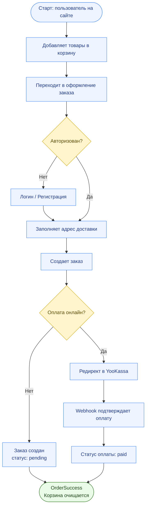
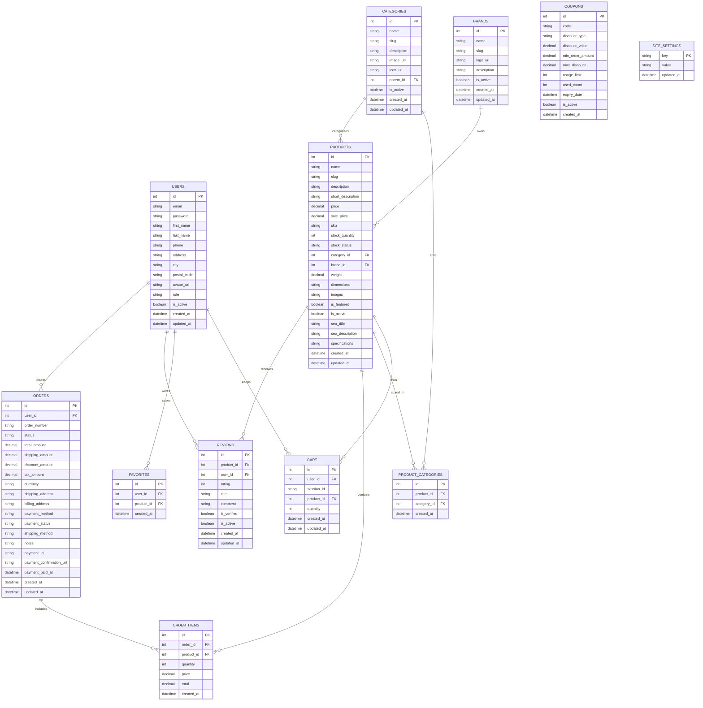

# Документация проекта TechStore

## 1. Архитектура и структура проекта

### Общая архитектура
Проект построен по классической схеме **Client–Server**:
- **Frontend (React)**: отвечает за UI, маршрутизацию и взаимодействие с API.
- **Backend (Node.js/Express)**: реализует REST API, бизнес-логику, работу с БД и интеграцию с платёжной системой.
- **SQLite**: основная БД проекта.

### Структура проекта
```
app_store_second/
├── backend/                 # Серверная часть
│   ├── config/              # Конфигурации (БД и др.)
│   ├── migrations/          # Миграции knex
│   ├── models/              # Модели данных
│   ├── routes/              # API маршруты
│   ├── middleware/          # Middleware (auth, error handling)
│   ├── scripts/             # Скрипты инициализации БД
│   ├── uploads/             # Загруженные файлы
│   ├── app.js / server.js   # Инициализация приложения
│   └── knexfile.js          # Конфиг миграций
├── frontend/                # Клиентская часть
│   ├── src/
│   │   ├── components/      # UI компоненты
│   │   ├── pages/           # Страницы приложения
│   │   ├── features/        # Redux slices
│   │   ├── services/        # API сервисы
│   │   ├── routes/          # Маршруты приложения
│   │   ├── layouts/         # Общие лэйауты
│   │   └── store/           # Redux store
│   └── public/              # Статика
├── start.sh                 # Скрипт запуска
└── documentation.md         # Текущий документ
```

---

## 2. Диаграмма деятельности

Ниже пример типового сценария оформления заказа:



---

## 3. ER-диаграмма базы данных (полная)



### Основные сущности
- **users**: id, email, password, first_name, last_name, phone, role, address, avatar_url …
- **products**: id, name, price, sku, images, specifications, is_featured …
- **categories**: id, name, slug, image_url, icon_url, parent_id …
- **orders**: id, user_id, order_number, status, total_amount, payment_status …
- **order_items**: id, order_id, product_id, quantity, price …
- **favorites**: id, user_id, product_id
- **site_settings**: key, value (например баннеры главной страницы)

---

## 4. Технологический стек

### Backend
- **Node.js + Express**
- **SQLite** + **knex** (миграции)
- **JWT** аутентификация
- **Multer** для загрузки файлов
- **YooKassa** интеграция платежей

### Frontend
- **React**
- **Redux Toolkit + Redux Persist**
- **React Router**
- **Tailwind CSS**

---

## 5. Описание страниц Frontend

### Публичные страницы
- **Главная (`/`)**: баннеры, предложения дня, преимущества, карта и контакты.
- **Каталог (`/products`)**: список товаров, фильтры, поиск.
- **Карточка товара (`/products/:id`)**: описание, галерея, отзывы.

### Пользовательские страницы
- **Корзина (`/cart`)**: список товаров, суммы, удаление.
- **Оформление заказа (`/checkout`)**: форма адреса, выбор доставки, оплата.
- **Успешный заказ (`/order-success`)**: статус оплаты и заказа.
- **Избранное (`/favorites`)**: сохранённые товары.
- **Профиль (`/profile`)**: данные пользователя, история заказов.

### Админ‑панель
- **Админ (`/admin`)**: управление товарами, категориями, заказами, баннерами.
  - Статистика
  - Список заказов (с возможностью смены статуса)
  - Управление товарами (создание, редактирование, копирование)
  - Категории (дерево, иконки)
  - Баннеры главной страницы

---

## Примечания
- Для работы требуется настроенный `.env` (см. `README.md`).
- Миграции выполняются командой:
  ```bash
  cd backend
  npm run migrate
  ```
